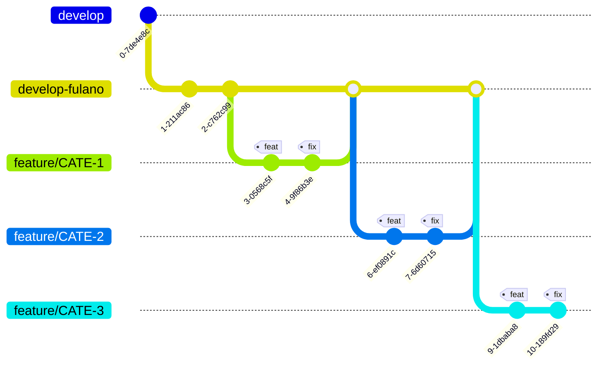

### Desafio :rocket: 

O desafio consiste em desenvolver uma Application Programming Interface (API) de um sistema de locação de imóveis.

Fique à vontade para montar a estrutura do banco conforme você desejar.

Para facilitar o desenvolvimento, Seeders e Factories podem ser criadas para verificação das regras de negócio;

Nesta API, teremos dois tipos de usuários: Locador e Locatário. Ela também possui os seguintes endpoints:

- Imóveis
    - Listagem
        - Visualizar lista de imóveis
        - Visualizar imóvel específico;
    - Criação
    - Exclusão
- Histórico de Locações;
- Realizar Locação;
- Cancelar Locação;
- Iniciar estadia;
- Finalizar estadia;

A listagem de imóveis podemos realizar filtros por quantidade máxima de pessoas ou valores;

O locatário pode ver as informações de um imóvel.

A listagem de imóveis, baseadas na consulta devem ter um cacheamento de 5 minutos, já a listagem de imóvel específico, um cacheamento de 10 minutos.

Toda alteração de imóvel deve esquecer o cacheamento antigo para receber um novo posteriormente.

O locador pode cadastrar seus imóveis e possui algumas informações obrigatórias como o CEP, descrição e características, valor por diária, quantidade máxima de pessoas e também a quantidade mínima de dias para locação.

O CEP deve ser validado através de uma comunicação externa com a API do Brasil API.

[Documentação da API](https://brasilapi.com.br/)

Essa comunicação externa deve estar protegida através do pacote do Circuit Breaker em casos de indisponibilidade.

Tanto o locatário como o locador podem acessar um histórico de locações através da tabela ***leases***. Esta tabela possui alguns campos obrigatórios, são eles: id do imóvel, id do locador, id do locatário, período e preço final.

Caso o locatário não queira mais locar o imóvel, ele pode realizar o cancelamento antes da data prevista, ao cancelar, deve ser emitida uma job notificando o cancelamento.

No agendamento da locação, as seguintes informações devem ser enviadas:

Quantidade de pessoas, período desejado e identificação do imóvel. Importante destacar que um agendamento **não** pode sobrescrever o período de outra locação.

As locações terão por padrão um status que será alterado conforme o processo de locação

A finalização da estadia pode ser realizada antes da data esperada para saída.

Fique à vontade para montar algumas estruturas do banco e outras regras de negócio conforme você desejar.

Fique a vontade para realização e desenvolvimento de seeders.
---

### É obrigatório ⚠

- Os retornos da API deve ser JSON.
- Implementação do pacote Circuit Breaker.
- Testes unitários
    - Para validação comportamental das classes.
- Testes de integração
    - Para validação de fluxo de requisição.
- Priorizar ao máximo utilização de recursos nativos do framework Laravel, Form requests, helpers e etc
- Implementação das camadas de Services e Repositories, através das documentações disponíveis
- PSR-12
- Autenticação JWT
- Documentação da API
- Configuração do Redis para utilização de cache

### É importante saber 🧠

- Classes: utilizar o padrão camelCase, porém com a primeira letra Maiúscula, também conhecido como UpperCamelCase ex: NomeDaClasse
- Métodos e variáveis: utilizar o padrão camelCase
- Migrations: (nome de campos), utilizar o padrão snake_case
- Nome de arquivos de migrations e tabelas: utilizar snake_case, no plural
- Rotas: utilizar o padrão kebab-case (exceto o parâmetro), ex: users/example-kebabs/{userId}
- Atentar as PSR’s: [https://www.php-fig.org/](https://www.php-fig.org/)
- Seguir as padronizações de Gitflow (baseado no nosso contexto) e padrão de mensagens utilizando conventional commits. [https://www.conventionalcommits.org/en/v1.0.0/](https://www.conventionalcommits.org/en/v1.0.0/)
- Documentações para consulta disponíveis na wiki
    - [Services e repositories](https://wiki.atlastechnol.com/Onboarding/guides-back-end/services-e-repositories)
    - [Comunicações externas](https://wiki.atlastechnol.com/Onboarding/guides-back-end/comunicacoes-externas)
    - [Testes com mocks](https://wiki.atlastechnol.com/Onboarding/guides-back-end/testes-com-mock)
    - [Circuit Breaker](https://wiki.atlastechnol.com/Onboarding/guides-back-end/circuit-breaker)

### Git Guidelines

- Seguir as diretrizes de Git da Atlas, conforme documentação [Git Guidelines](https://wiki.atlastechnol.com/Documentacoes/Tecnologia/Guidelines/Git).

---

### Durante o processo de ambientação é importante que: 📌

- Solicitação de revisão de PRs também deve ser solicitado no canal Back-End da turma, **turma-cate-XX-back-end** através do padrão proposto
- Aproveite o máximo o processo, não se preocupe em fazer códigos complexos, faça o simples. Evite se basear em códigos de Pull Requests anteriores, o ato dificulta a remoção de impedimentos e prejudica a identificação de pontos de melhorias.
- Não se esqueça, o objetivo da ambientação técnica é absorver o máximo possível de técnicas, padrões e conceitos que utilizamos hoje em nossos projetos.
- Lembre-se que o CATe é o primeiro time que você estará atuando na Atlas, o comportamento de equipe é esperado, se possível interaja com os colegas, auxilie e aprenda com eles.
- Faça bom uso da comunicação assíncrona, sendo ela sempre objetiva.
- Utilize o máximo dos recursos nativos do Framework que possui conhecimento.

---
