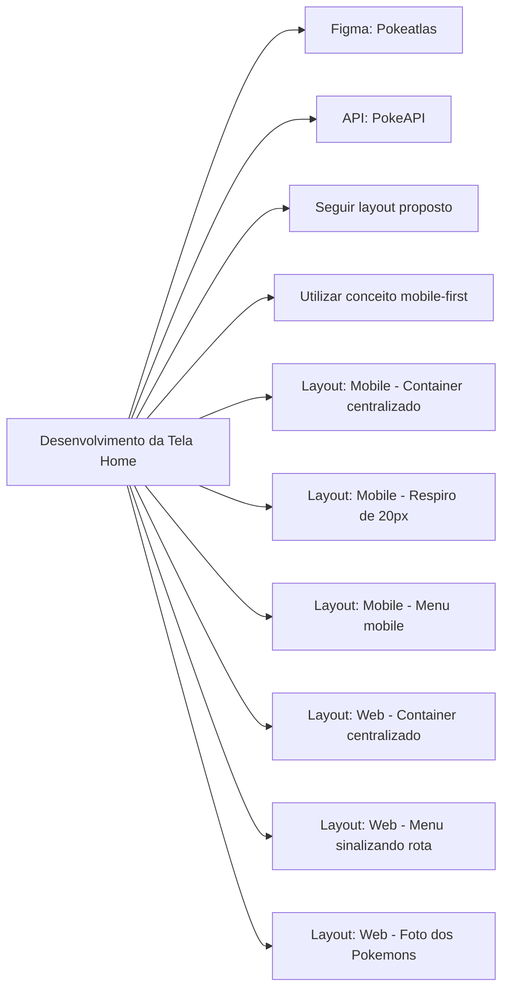
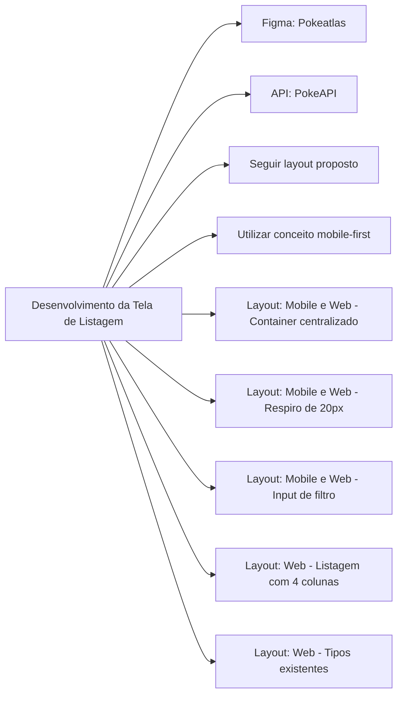
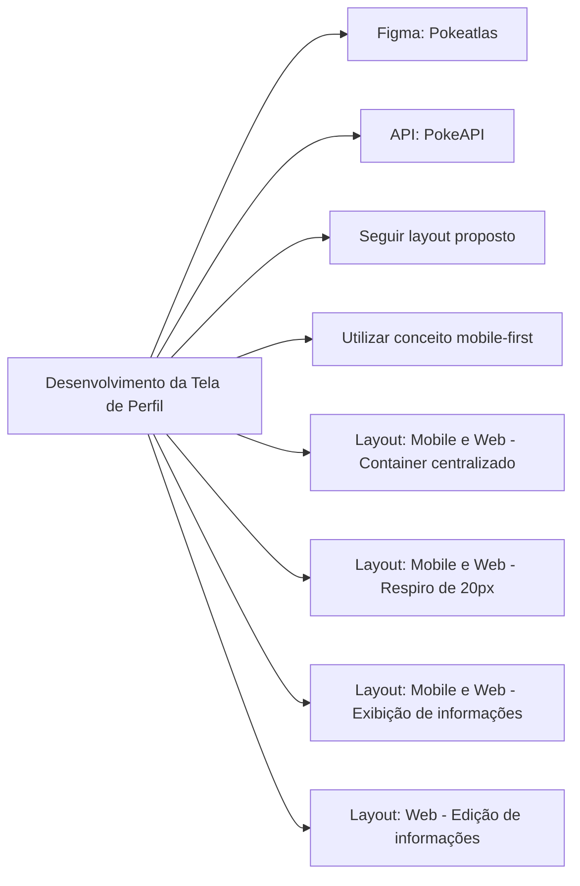
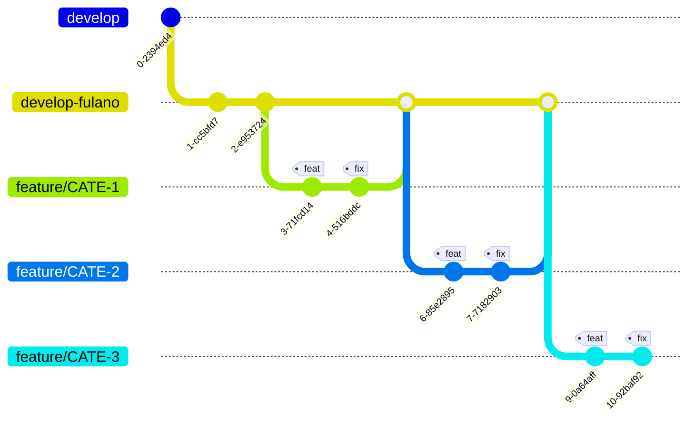

# Atividades de Desenvolvimento

## Tarefa: Desenvolvimento da Tela Home

### User story

Como usuário, quero acessar uma página que contenha dados referentes a aplicação, seja autoexplicativa e funcional.

#### O que é esperado?

#### Tecnologias utilizadas:

- Template engine Blades
- JavaScript
- SCSS - Nomenclatura BEM
- Vue (opcional)

#### Git Guidelines

- Seguir as diretrizes de Git da Atlas, conforme documentação [Git Guidelines](https://wiki.atlastechnol.com/Documentacoes/Tecnologia/Guidelines/Git).
- Documentações do Chapter Front-end: [Documentações Chapter Front-end](https://wiki.atlastechnol.com/Onboarding/front-end)

### Fluxo de trabalho

1. Desenvolver a tela Home seguindo as diretrizes acima.
2. Realizar, no mínimo, 2 commits por dia.
3. Após conclusão, colocar a tarefa em code review no board.
4. Comunicar o mentor para avaliação e obtenção de aprovações mínimas.
5. Após aprovação, encaminhar para o board de QA Review.
6. Atentar aos feedbacks dos QAs e corrigir, se necessário.
7. Após entrega para o QA, aguardar feedbacks e corrigir eventuais fixes levantados.
8. Após aprovação final do QA, a tarefa segue para deploy pelo QA.

## Tarefa: Desenvolvimento da Tela de Listagem

### User story

Como usuário, quero acessar uma página que contenha a listagem da primeira geração (primeiros 150) dos Pokemons, consiga filtrar por nome/número e tipos.

#### O que é esperado?

#### Tecnologias utilizadas:

- Template engine Blade
- TypeScript
- Vue / Vuex
- Axios
- SCSS - Nomenclatura BEM
- Jest

#### Git Guidelines

- Seguir as diretrizes de Git da Atlas, conforme documentação [Git Guidelines](https://wiki.atlastechnol.com/Documentacoes/Tecnologia/Guidelines/Git).

# Atividades de Desenvolvimento

## Tarefa: Desenvolvimento da Tela de Perfil

### User story

Como usuário, quero acessar uma página de perfil que exiba informações sobre o usuário logado e permita a edição dessas informações.

#### O que é esperado?

#### Tecnologias utilizadas:

- Template engine Blade
- JavaScript
- SCSS - Nomenclatura BEM
- Vue / Vuex
- Axios

#### Git Guidelines

- Seguir as diretrizes de Git da Atlas, conforme documentação [Git Guidelines](https://wiki.atlastechnol.com/Documentacoes/Tecnologia/Guidelines/Git).

